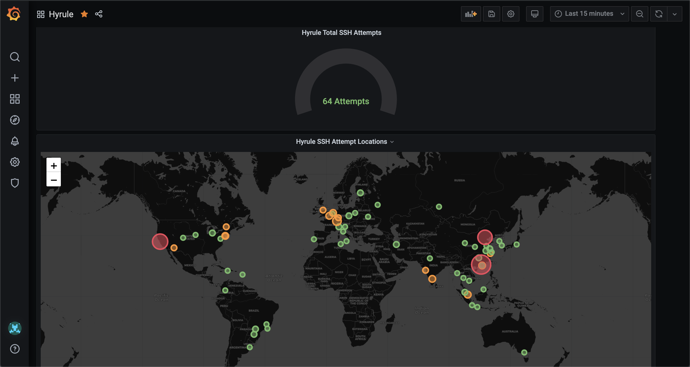

# Report SSHD Attempts

A python script to geo-locate all of the IP's that have attempted to SSH in to my publicly facing
SSH server in the last 24 hours. Statsd metrics are pushed to my InfluxDB instance (through Telegraf)
and visualised in Grafana.

